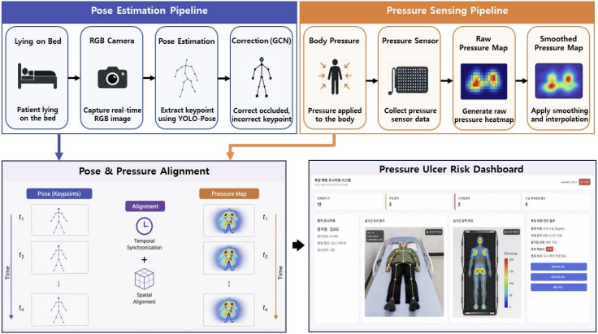
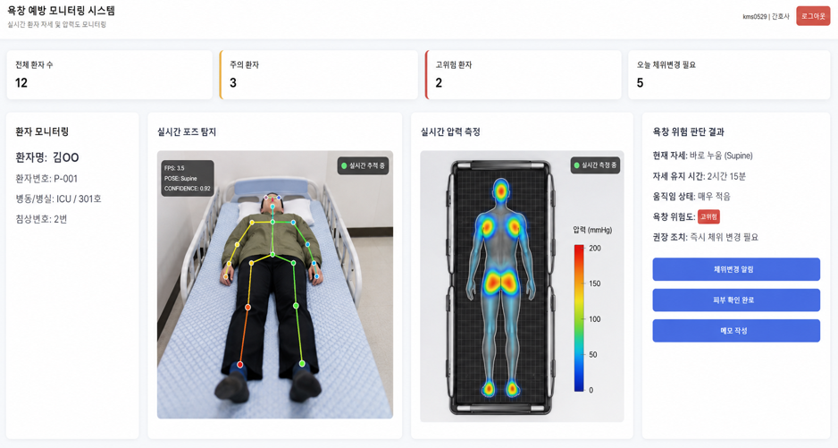

# Pose-Pressure Ulcer AIIIIIIIIIII

Real-Time Pressure Ulcer Prevention System using Pose Estimation and Pressure Sensing.

---

## 1. Project Overview

Pressure ulcers can occur when patients remain in the same posture for long periods of time.  
This project proposes a real-time monitoring system that combines:

- YOLO-based pose estimation
- GCN-based keypoint correction
- pressure sensing
- pose-pressure alignment
- real-time dashboard visualization

The goal is to monitor posture and pressure concentration simultaneously for early ulcer-risk analysis.

---

## 2. Pipeline

<p align="center">
  
</p>

- #### Pose Estimation Pipeline
  - Capture real-time RGB images and estimate body keypoints, followed by GCN-based keypoint refinement.

- #### Pressure Sensing Pipeline
  - Acquire pressure sensor data and generate a smoothed body pressure heatmap through interpolation.

- #### Pose & Pressure Alignment
  - Temporally and spatially align pose keypoints with pressure maps for integrated risk analysis.

---

## 3. Setting

<table>
<tr>
<td valign="top">

### Environment

| Category | Specification |
|-----------|--------------|
| OS | Windows 11 |
| GPU | NVIDIA RTX 5060 8GB |
| CUDA | 12.8 |
| Python | 3.10.20 |
| PyTorch | 2.7.1+cu128 |

</td>
<td valign="top">

### Hardware Requirements

| Component | Description |
|------------|------------|
| Camera | USB Camera |
| Microcontroller | Arduino Mega 2560 |
| Pressure Sensors | 32-Channel Pressure Sensor Array |
| Bed Frame | Custom Pressure Sensing Bed |
| GPU | NVIDIA CUDA-enabled GPU (Recommended) |

</td>
</tr>
</table>

#### Installation

```bash
pip install -r requirements.txt
```

#### Dataset

The GCN model was trained using the **SLP (Sleep Pose) Dataset**, a large-scale multimodal benchmark designed for in-bed human pose estimation.

##### Dataset Repository

- https://github.com/ostadabbas/SLP-Dataset-and-Code

---

## 4. Usage

### 4-1. GCN Training

There are two ways to use the GCN model.

#### Option 1. Train Your Own GCN Model

##### Training Workflow

```text
SLP Dataset
    ↓
YOLO Pose Inference
    ↓
COCO-17 → SLP-14 Joint Mapping
    ↓
Generate GCN Dataset
    ↓
Train GCN
    ↓
best_gcn.pt
```

##### Generate GCN Dataset

```bash
python pose/gcn/generate_gcn_dataset.py
```

##### Train GCN

```bash
python pose/gcn/train_gcn_rgb.py
```

---

#### Option 2. Use the Pretrained Model

If you do not want to train the model from scratch, you can directly use the pretrained checkpoint provided in this repository.

##### Pretrained Checkpoint

```text
pose/gcn/best_gcn.pt
```
---

### 4-2. Pressure Sensing

Connect 16 pressure sensors to the Arduino Mega 2560.


The pressure sensor is installed beneath the bed surface and collects real-time data.


#### Arduino Firmware

Upload the pressure sensor acquisition firmware to the Arduino Mega 2560.

```text
pressure/arduino/pressure_sensor_test.ino
```

#### Pressure Heatmap Visualization

Run the pressure heatmap visualization module.

```bash
python pressure/pressure_map/pressure_test.py
```

---

### 4-3. Dashboard

The dashboard combines the trained GCN model and pressure sensing module into a single monitoring dashboard.

#### Required Files

```text
dashboard/pressure_monitor_app.zip
```

#### Run Dashboard

```bash
python app.py
```
---

## 5. Results
### 5-1. Perfomance Comparison

| Dataset | Method | FPS | PCKh@0.5 | mAP@0.50 | MPJPE |
|:-------:|:-------:|:---:|:--------:|:--------:|:-----:|
| SLP | YOLO26s-Pose (Baseline) | 49.911 | 0.628 | 0.608 | 0.260 |
| SLP | YOLO26s-Pose + GCN | **49.889** | **0.819** | **0.777** | **0.150** |

### 5-2. GCN Refinement Result

<p align="center">
  
</p>

### 5-3. Demonstration

<p align="center">
  
</p>


#### Output
- Real-Time Pose Estimation (YOLO + GCN)
- Pressure Heatmap Visualization
- Pose–Pressure Synchronization
- Integrated Monitoring Dashboard

---

## 6. Project Structure

```text
Pressure-Ulcer-Prevention-AI
│
├── dashboard/
│   └── pressure_monitor_app.zip
│
├── docs/
│   ├── dashboard/
│   │   ├── dashboard_demo.png
│   │   └── system_demo.png
│   │
│   ├── gcn/
│   │   └── gcn_refinement.png
│   │
│   ├── hardware/
│   │   ├── arduino_connection.jpg.png
│   │   └── pressure_sensor_bed.jpg.png
│   │
│   └── pipeline/
│       └── system_pipeline.png
│
├── pose/
│   ├── gcn/
│   │   ├── best_gcn.pt
│   │   ├── generate_gcn_dataset.py
│   │   └── train_gcn_rgb.py
│   │
│   ├── realtime/
│   │   └── run_realtime_yolo_gcn.py
│   │
│   └── yolo-pose/
│       └── yolo26n-pose.pt
│
├── pressure/
│   ├── arduino/
│   │   └── pressure_sensor_test.ino
│   │
│   └── pressure_map/
│       └── pressure_test.py
│
├── README.md
├── requirements.txt
├── LICENSE
└── .gitignore
```

#### Directory Description

| Directory                | Description                                                   |
| ------------------------ | ------------------------------------------------------------- |
| `dashboard/`             | Real-time monitoring dashboard                                |
| `docs/`                  | Project images, pipeline diagrams, and documentation          |
| `pose/gcn/`              | GCN dataset generation, training scripts, and trained weights |
| `pose/realtime/`         | Real-time YOLO + GCN inference pipeline                       |
| `pose/yolo-pose/`        | YOLO Pose model weights                                       |
| `pressure/arduino/`      | Arduino firmware for pressure sensor acquisition              |
| `pressure/pressure_map/` | Pressure heatmap generation and visualization                 |
