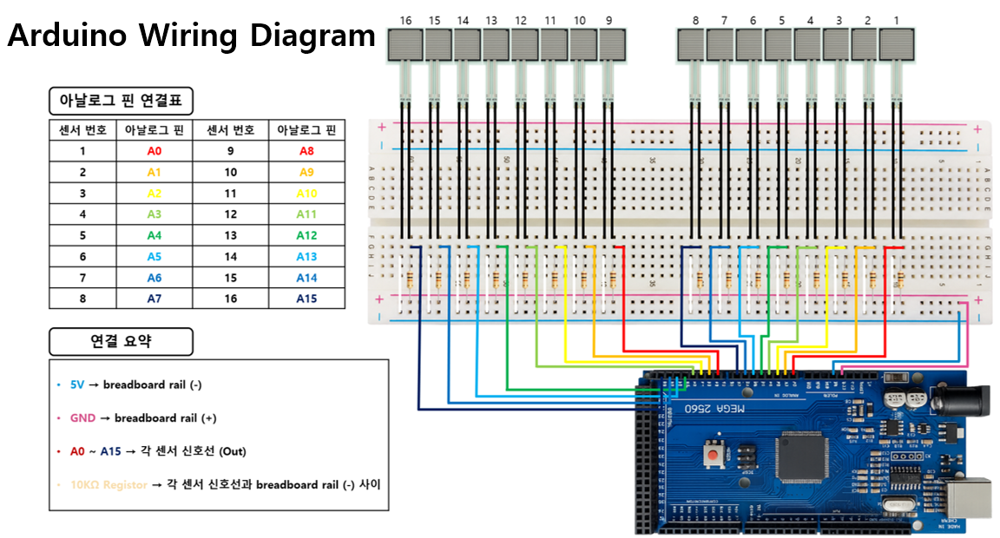
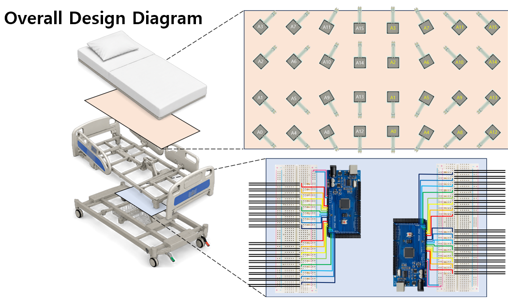
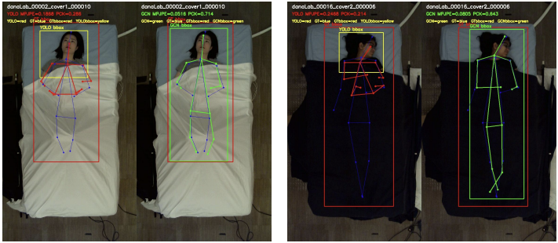

# Pose-Pressure Ulcer AI

Real-Time Pressure Ulcer Prevention System using Pose Estimation and Pressure Sensing.

---

## 0. Project Overview

Pressure ulcers can occur when patients remain in the same posture for long periods of time.  
This project proposes a real-time monitoring system that combines:

- YOLO-based pose estimation
- GCN-based keypoint correction
- pressure sensing
- pose-pressure alignment
- real-time dashboard visualization

The goal is to monitor posture and pressure concentration simultaneously for early ulcer-risk analysis.

<p align="center">
  
</p>

---

## 1. Demonstration

<p align="center">
  
</p>

#### Real-Time Features

- patient pose estimation
- pressure heatmap visualization
- synchronized pose-pressure monitoring
- real-time dashboard system

---

## 2. Setup

### 2-1. Environment Setup

#### Requirements

- Python 3.10
- PyTorch
- CUDA 12.8
- OpenCV
- Flask
- Ultralytics YOLO

---

#### Recommended Environment

| Category | Specification |
|---|---|
| GPU | NVIDIA RTX 5060 8GB |
| Python | 3.10.20 |
| PyTorch | 2.7.1+cu128 |
| CUDA | 12.8 |

---

#### Clone Repository

```bash
git clone https://github.com/JH-kxx/Pose-Pressure-Ulcer-AI.git
cd Pose-Pressure-Ulcer-AI
```

---

#### Install Dependencies

```bash
pip install -r requirements.txt
```

---

### 2-2. Hardware Setup

#### Hardware Components

| Component | Description |
|---|---|
| RGB Camera | Patient posture acquisition |
| Pressure Sensor | Pressure distribution measurement |
| Arduino | Sensor communication |
| PC / GPU Server | Real-time inference |

---

#### Arduino Connection

<p align="center">
  
</p>

---

#### Pressure Sensor Bed

<p align="center">
  
</p>

---

#### Pressure Heatmap

<p align="center">
  
</p>

---

### 2-3. Dataset & Model

#### Dataset

- SLP Dataset  
  https://github.com/ostadabbas/SLP-Dataset-and-Code

---

#### Model Weights

Place model files inside:

```text
pose/yolo/
pose/gcn/
```

Required files:

```text
yolo26n-pose.pt
best_gcn.pt
```

---

# 3. System Pipeline

<p align="center">
  
</p>

---

The proposed system consists of:

- pose estimation
- GCN refinement
- pressure sensing
- pose-pressure alignment
- dashboard visualization

---

## 3-1. Pose Estimation Pipeline

```text
RGB Camera
    ↓
YOLO Pose Estimation
    ↓
17-to-14 Keypoint Mapping
    ↓
Residual GCN Refinement
    ↓
Refined Pose Output
```

---

### GCN Refinement Result

<p align="center">
  
</p>

---

### Quantitative Evaluation

| Dataset | Method | FPS | PCKh@0.5 | mAP@0.50 | MPJPE |
|---|---|---|---|---|---|
| SLP | YOLO26s-Pose | 49.911 | 0.628 | 0.608 | 0.260 |
| SLP | + GCN | 49.889 | **0.819** | **0.777** | **0.150** |
| OCHuman | YOLO26s-Pose | 45.029 | 0.123 | 0.045 | 0.643 |
| OCHuman | + GCN | 45.200 | **0.493** | **0.300** | **0.381** |

---

<table align="center">
<tr>

<td valign="top">

### Training Configuration

| Parameter | Value |
|---|---|
| Batch Size | 128 |
| Epochs | 80 |
| Learning Rate | 0.001 |
| Optimizer | AdamW |
| Hidden Dimension | 64 |
| GCN Layers | 4 |

</td>

<td width="100"></td>

<td valign="top">

### Training Environment

| Category | Specification |
|---|---|
| GPU | NVIDIA RTX 5060 8GB |
| CUDA | 12.8 |
| Python | 3.10.20 |
| PyTorch | 2.7.1+cu128 |

</td>

</tr>
</table>

---

### Related Code

| File | Description |
|---|---|
| [`pose/gcn/train_gcn_rgb.py`](pose/gcn/train_gcn_rgb.py) | Residual GCN training |
| [`pose/gcn/generate_gcn_dataset.py`](pose/gcn/generate_gcn_dataset.py) | GCN dataset generation |
| [`realtime/run_realtime_yolo_gcn.py`](realtime/run_realtime_yolo_gcn.py) | Real-time YOLO + GCN inference |

---

## 3-2. Pressure Sensing Pipeline

```text
Pressure Sensor
    ↓
Arduino Serial Communication
    ↓
Pressure Data Acquisition
    ↓
Pressure Heatmap Generation
```

---

<p align="center">
  
</p>

---

### Related Code

| File | Description |
|---|---|
| [`pressure/arduino/`](pressure/arduino/) | Arduino sensor communication |
| [`pressure/serial/`](pressure/serial/) | Serial data processing |
| [`pressure/pressure_map/`](pressure/pressure_map/) | Pressure heatmap visualization |

---

## 3-3. Pose & Pressure Alignment

### Spatial Alignment

The RGB camera is fixed relative to the pressure sensor bed to maintain consistent coordinate correspondence.

---

### Temporal Alignment

Synchronization is controlled through Arduino serial delay adjustment for real-time alignment.

---

## 3-4. Dashboard

<p align="center">
  
</p>

---

### Dashboard Features

- real-time pose visualization
- pressure heatmap monitoring
- synchronized pose-pressure analysis
- ulcer risk monitoring

---

# 4. Future Work

- infrared camera integration
- temperature sensor fusion
- lightweight edge AI optimization

---

# Repository Structure

```text
Pose-Pressure-Ulcer-AI/
│
├── pose/
│   ├── yolo/
│   ├── gcn/
│
├── pressure/
│   ├── arduino/
│   ├── serial/
│   └── pressure_map/
│
├── realtime/
├── dashboard/
├── alignment/
├── results/
└── docs/
```
